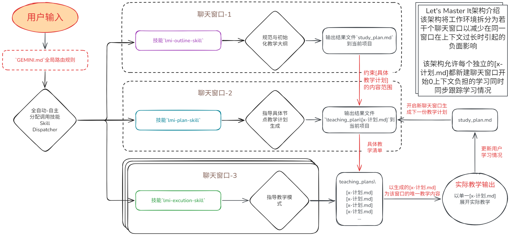

<div align="center">

# 🎓 Let's Master It (LMI)
### 面向 STEM 自学者的公理化·分层解耦 AI 教学 Skill Set

[](#安装--使用方法)
[](#)
[](#)

<p align="center">
  <b>材料可选</b> • <b>两段式审批</b> • <b>三段式上下文隔离</b> • <b>严谨理论推导</b>
</p>

</div>

---


<details>
<summary><b>目录 (Table of Contents) —— 点击展开</b></summary>

- [Let's Master It 技能的定位与特色](#lets-master-it-技能的定位)
- [安装与使用方法](#安装--使用方法)
  - [Antigravity 平台](#antigravity-平台)
  - [Cursor与其他 Agent 平台](#cursor-与其他平台)
- [LMI 架构介绍与组件构成](#lmi架构示例图)
  - [LMI 技能集内容](#lmi-技能集内容与作用)
- [测试表现与模型推荐](#测试表现与模型推荐)

</details>

---
### [👉点击跳转至`lmi-outline-skill`大纲生成与原始材料还原度对比](./compare_asset/高等数学/compare.md)
## Let's Master It 技能的定位
当你知道一个”学习目标“，但是不知道从何学起时，它会构建一套完整的学习路线，该路线以严格的公理体系为依据。

适用于系统化 STEM 自学：”从零开始“ "自学" "ai辅助教学" "基础巩固"  "精通" "理论培养"


### "LMI"(Let's Master It) 的特色是
1. **材料自主可控**：用户决定引用材料
2. **两段式审批与可修改**：
	- 用户审批“学习大纲”
	- 用户审批“教学计划”
3. **三段式独立上下文结构**：采用“锚点”文件进行追踪，解耦长对话
4. **知识点全覆盖**：对引用材料(知识点)的全面覆盖	
5. **严谨的教学语言**：以理论证明为核心，全过程逐步推导，同时包含特色形式计算


## Let's Master It 技能解决了什么问题？
针对长会话中 LLM 的“注意力衰减”与“教学幻觉”，LMI 将教学过程拆分为**大纲规划**、**课件生成**与**单课精讲**三阶段，以 Markdown 锚点文件作为外置记忆，实现跨会话无缝教学。

#### 1. 最大程度的分层任务规划与教学解耦
模拟真实教学方法，先制定教学路线，再制定教学计划，最后进行实际教学。
#### 2. 上下文隔离
每部分任务都可以由不同的上下文窗口执行，解决了大模型在长上下文环境带来的“注意力衰减”和“上下文污染”
#### 3. 持久化保存与可交接模式
将 Markdown 文件作为无状态和 LLM 之间的“外部记忆介质”，保证了在不同上下文窗口的输出一致性。

## 安装 & 使用方法 

### 🤖 一键安装（直接将下方内容复制发给你的 AI agent）：

> 复制以下内容发送给你当前的 AI agent：
> ```text
> 请帮我安装并配置来自 GitHub 的 LMI 教学技能包：
> 1. 访问/克隆仓库：https://github.com/FalsenJing/LetsMasterIt-Skills.git
> 2. 将该仓库中的 `.agents/skills/` 目录完整复制到我当前项目的 `.agents/skills/` 路径下。
> 3. 将仓库根目录下的 `GEMINI.md` 下载并放置到我当前项目的根目录下（作为全局意图路由）。
> 4. 完成后提示我安装成功，并告诉用户“开启新窗口进行学习“。
> ```


### 手动安装
#### Antigravity 平台

1. 克隆仓库到本地文件夹

```bash 
git clone https://github.com/FalsenJing/LetsMasterIt-Skills.git
```


2. 在 `Antigravity` 平台上以该目录为工作区建立项目 


3. 在聊天窗口中输入”我想要学习/了解【某个内容】“

>该技能包已配备了自动调用`skill`路由，无需显式启用技能。
---

#### Cursor 与其他平台

其他 Agent 平台可能需要对 `GEMINI.md` 意图路由进行适配

1. 复制仓库链接，让 ai 协助克隆安装 
```bash
git clone https://github.com/FalsenJing/LetsMasterIt-Skills.git
```
2. 并告知 AI ："**阅读并适配根目录下的 `GEMINI.md` 规则路由**"

3. 在聊天窗口中输入”我想要学习/了解【某个内容】“


## LMI架构示例图



```
.LMI-Skills/
├── GEMINI.md                  # 全局调度路由
├── skills/
│   ├── lmi-outline-skill/     # 阶段1: 生成大纲
│   ├── lmi-plan-skill/        # 阶段2: 单节点计划
│   ├── lmi-execution-skill/   # 阶段3: 逐课教学
│   └── linear-tikzdraw-skill/ # (实验性) 可视化绘图
└── images/
```


### LMI-技能集内容与作用

| skill                           | 功能概述                                                         |
| :------------------------------ | ------------------------------------------------------------ |
| `GEMINI.md`                     | 全局路由：负责监听输入与自动调用skills                                       |
| `skills/lmi-outline-skill`     | **阶段1**：依据教材/材料生成“教学大纲`study_plan.md`”                       |
| `skills/lmi-plan-skill`        | **阶段2**：依据教材大纲学习情况，按节点生成“学习计划`/teaching_plans/[x]-计划.md`”    |
| `skills/lmi-execution-skill`   | **阶段3**：依据某个学习计划，且只聚焦于该计划内容展开具体教学                            |
| `skills/linear-tikzdraw-skill` | ⚠️(**实验性**)用于在`obsidian`中配合`tikzjax`插件进行可视化讲解，默认不调用 |


该 `技能包` 实现了任务的可拆分与逐步执行，从根本上减少了 ai 教学在幻觉与上下文过长对教学质量产生的影响。

因此所有具体教学都可以在新聊天窗口中无缝衔接，其中技能`lmi-outline-skill`和`lmi-plan-skill`分别生成两个“锚点”文件：
- `study_plan.md`记录了用户“学习目标”、“学习路线与情况”、“疑难点收录”

- `teaching_plans/`目录内的文件记录了用户的“学习课件”——用于规范 ai 的教学范围
	- 这理论上减少了 ai 进行教学时的”发散性思维“所导致的幻觉。


>迁移本`技能包`和`study_plan.md`即可在任意设备同步学习情况——无需任何多余提示词。


## 测试表现与模型推荐
经过我简单的多次测试($>20$次)对比，在 `Antigravity` 平台中：
- 使用 `Gemini3.7flash-High` 进行“教学大纲”、“教学计划”的制定，知识点、教材内容覆盖最为详细。

- 实施具体教学则相反，使用 `Gemini3.1pro-High` 进行“按计划教学”时，教学与证明连续性与准确性最佳。

>在具体教学时，对于较长的教学计划`pro`模型会自动分批教学，而`flash`会一口气讲完（无提示）——这可能是导致`flash`模型在推导过程存在较多跳步的原因。

在使用“LMI”时，建议：
| 任务                         | 推荐模型                                                    | 	使用体验	|
| :------------------------------ | ------------------------------------------------------------ |---------|
|阶段 1：大纲梳理 (lmi-outline-skill) | Gemini 3.7 Flash (High) / flash家族模型           |        广度检索强，教材与知识点覆盖最为全面细致      |
| 阶段 2：计划制定 (lmi-plan-skill)     | Gemini 3.7 Flash (High) / flash家族模型               |	任务拆解效率高，结构化生成规范|
|阶段 3：具体教学 (lmi-execution-skill) | Gemini 3.1 Pro / 大参数模型|具备深度推导能力，步步推演准确，连续性最佳    |

>在使用较强的模型时可能不需要为了不同任务专门切换模型（例如:"Grok4.6"）


## 未来更新计划
- [ ] 增加测试案例
- [ ] 建立可验证标准化benchmark测试
- [ ] 多语种适配（Multi-Language Support）

## 📄 开源许可证 (License)

本项目基于 [MIT License](LICENSE) 开源。

⭐ 如果这个项目对你有帮助，欢迎点个 Star 支持一下！

