# AI 生成大纲 vs 教材原始目录 — 对比展示

> **对比对象**
> - 🤖 **AI 生成大纲**：由 AI 技能 `lmi-outline-skill` 根据用户需求自动规划的《高等数学》学习计划
> - 📖 **教材原始目录**：同济大学《高等数学》第八版 目录页截图

## 结论
与原始教材对比，生成大纲在“章-节”层面上对**必修**知识的覆盖达到 **100%。**

如果纯按照节点还原度为 **87.5%**

>由 `lmi-outline-skill`技能生成大纲总共 63个节点 ÷ 原始教材总共72个节点 为 63/72 x 100% = 87.5% 得出。
>- 其中缺失的 8 个节点为教材中**明确标注`*`的选修节点**，1 个节点为查表节点（积分表的使用）。

## 以下是完整对比展示

### AI 大纲生成过程

点击展开 AI 交互过程截图

<table>
<tr>
<td align="center">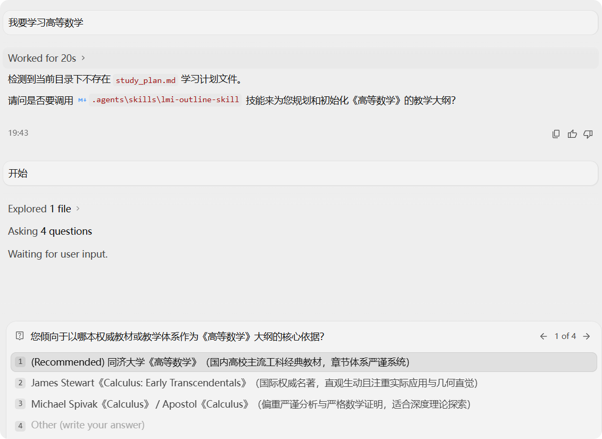 ① 检测到无学习计划，调用技能生成大纲</td>
<td align="center"> ② 询问学习目标与应用场景</td>
</tr>
<tr>
<td align="center"> ③ 询问大纲覆盖范围</td>
<td align="center"> ④ 询问学习深度与讲解风格</td>
</tr>
</table>

---

##  逐章对比：
👉 [点击跳转"study_plan.md"大纲文件](./study_plan.md)

<b>第一章　函数与极限</b>

 

<table>
<tr>
<th width="50%">📖 教材原始目录</th>
<th width="50%">🤖 AI 生成大纲</th>
</tr>
<tr>
<td>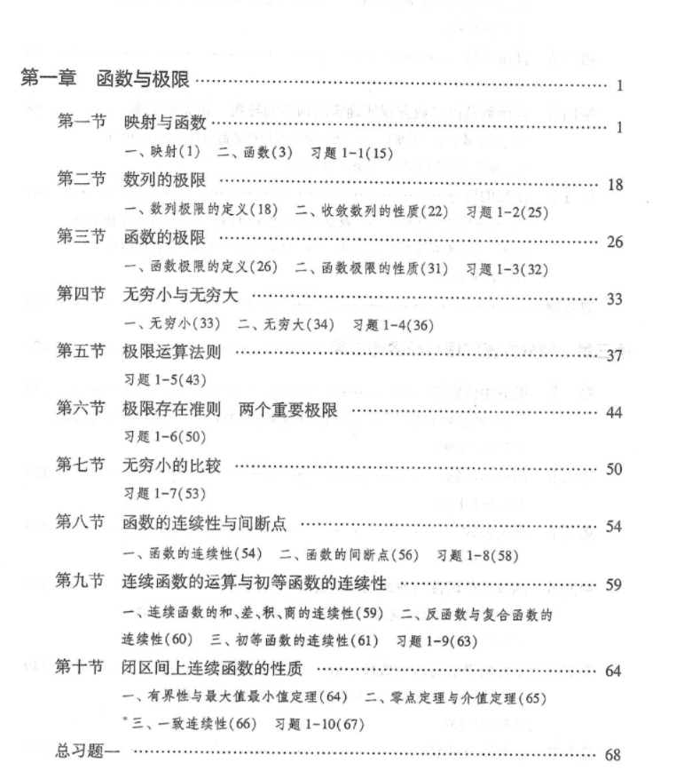</td>
<td>

- [ ] 1.1 映射与函数的基础性质（单调、奇偶、周期、有界）
- [ ] 1.2 数列极限的定义（ε-N 语言）与性质
- [ ] 1.3 函数极限的定义（ε-δ 语言、x→∞ 极限）与性质
- [ ] 1.4 无穷小与无穷大的概念与运算法则
- [ ] 1.5 极限运算法则与复合函数的极限
- [ ] 1.6 极限存在准则（夹逼准则、单调有界准则）与两个重要极限
- [ ] 1.7 无穷小的比较与等价无穷小代换
- [ ] 1.8 函数的连续性、间断点分类及初等函数的连续性
- [ ] 1.9 闭区间上连续函数的性质（有界性、最值定理、介值定理与零点定理）

</td>
</tr>
</table>

<b>第二章　导数与微分</b>

 

<table>
<tr>
<th width="50%">📖 教材原始目录</th>
<th width="50%">🤖 AI 生成大纲</th>
</tr>
<tr>
<td>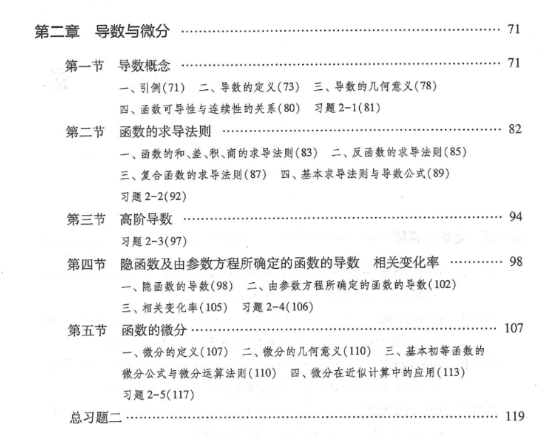</td>
<td>

- [ ] 2.1 导数的定义、几何意义与物理意义
- [ ] 2.2 函数的求导法则（四则运算、反函数、复合函数求导法则/链式法则）
- [ ] 2.3 高阶导数的概念与莱布尼茨公式
- [ ] 2.4 隐函数及由参数方程所确定的函数的导数
- [ ] 2.5 函数的微分定义、几何意义与微积分近似计算

</td>
</tr>
</table>

<b>第三章　微分中值定理与导数的应用</b>

 

<table>
<tr>
<th width="50%">📖 教材原始目录</th>
<th width="50%">🤖 AI 生成大纲</th>
</tr>
<tr>
<td>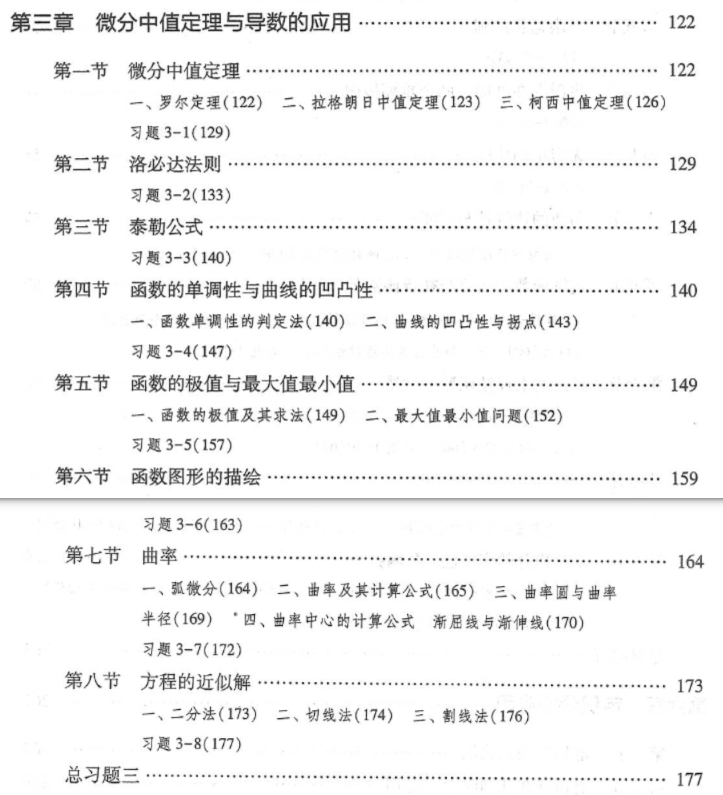</td>
<td>

- [ ] 3.1 微分中值定理（费马引理、罗尔定理、拉格朗日中值定理、柯西中值定理）
- [ ] 3.2 洛必达法则及其未定式求极限
- [ ] 3.3 泰勒公式与麦克劳林公式（含佩亚诺余项与拉格朗日余项）
- [ ] 3.4 函数单调性判别法与曲线的凹凸性、拐点
- [ ] 3.5 函数的极值与最值问题求解
- [ ] 3.6 函数图形的描绘（渐近线与整体作图）
- [ ] 3.7 曲率与曲率圆

</td>
</tr>
</table>

<b>第四章　不定积分</b>

 

<table>
<tr>
<th width="50%">📖 教材原始目录</th>
<th width="50%">🤖 AI 生成大纲</th>
</tr>
<tr>
<td>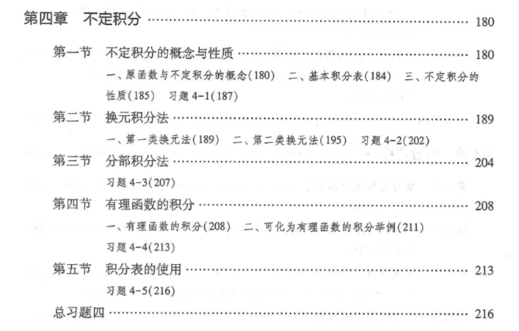</td>
<td>

- [ ] 4.1 不定积分的概念、性质与基本积分表
- [ ] 4.2 第一类换元积分法（凑微分法）
- [ ] 4.3 第二类换元积分法（三角代换、根式代换）
- [ ] 4.4 分部积分法与常见分部积分类型
- [ ] 4.5 有理函数的积分与简单三角有理式的积分

</td>
</tr>
</table>

<b>第五章　定积分</b>

 

<table>
<tr>
<th width="50%">📖 教材原始目录</th>
<th width="50%">🤖 AI 生成大纲</th>
</tr>
<tr>
<td>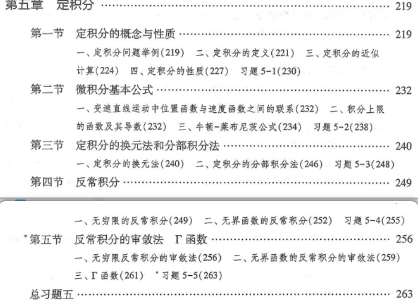</td>
<td>

- [ ] 5.1 定积分的概念、几何意义与基本性质
- [ ] 5.2 微积分基本定理与牛顿-莱布尼茨公式
- [ ] 5.3 定积分的换元积分法与分部积分法
- [ ] 5.4 反常积分（无穷限反常积分与无界函数的瑕积分）

</td>
</tr>
</table>

<b>第六章　定积分的应用</b>

 

<table>
<tr>
<th width="50%">📖 教材原始目录</th>
<th width="50%">🤖 AI 生成大纲</th>
</tr>
<tr>
<td>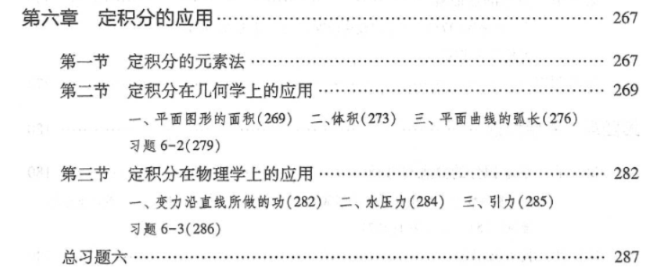</td>
<td>

- [ ] 6.1 定积分的微元法（元素法）思想
- [ ] 6.2 平面图形面积的计算（直角坐标与极坐标）
- [ ] 6.3 旋转体体积与平行截面面积已知的立体体积
- [ ] 6.4 平面曲线的弧长计算
- [ ] 6.5 定积分在物理学中的应用（变力做功、水压力、引力）

</td>
</tr>
</table>

<b>第七章　微分方程</b>

 

<table>
<tr>
<th width="50%">📖 教材原始目录</th>
<th width="50%">🤖 AI 生成大纲</th>
</tr>
<tr>
<td>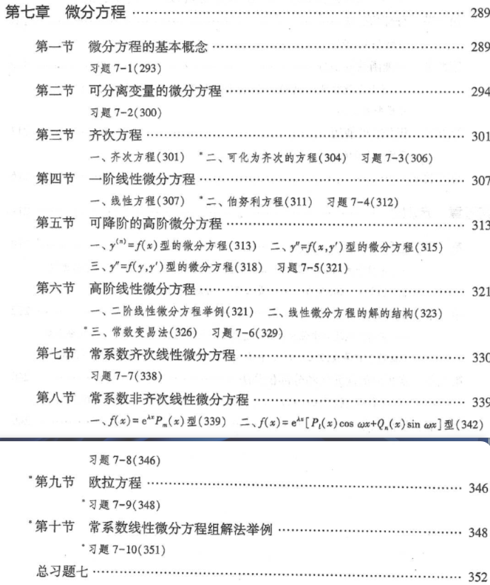</td>
<td>

- [ ] 7.1 微分方程的基本概念（阶、解、通解、特解、初始条件）
- [ ] 7.2 可分离变量的微分方程
- [ ] 7.3 齐次微分方程与一阶线性微分方程（常数变易法）
- [ ] 7.4 可降阶的高阶微分方程
- [ ] 7.5 高阶线性微分方程解的结构（齐次与非齐次线性微分方程）
- [ ] 7.6 二阶常系数齐次线性微分方程
- [ ] 7.7 二阶常系数非齐次线性微分方程（待定系数法）

</td>
</tr>
</table>

<b>第八章　空间解析几何与向量代数</b>

 

<table>
<tr>
<th width="50%">📖 教材原始目录</th>
<th width="50%">🤖 AI 生成大纲</th>
</tr>
<tr>
<td>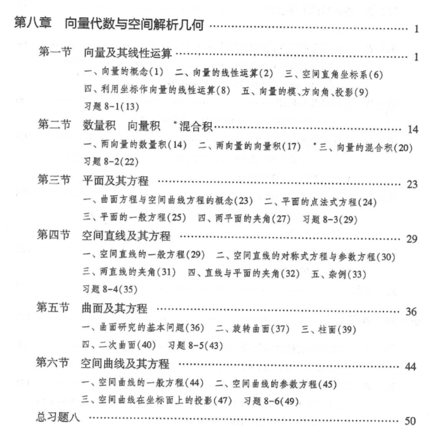</td>
<td>

- [ ] 8.1 向量的线性运算与空间直角坐标系
- [ ] 8.2 向量的数量积、向量积与混合积
- [ ] 8.3 平面及其方程（点法式、一般式、截距式）
- [ ] 8.4 空间直线及其方程（对称式、参数式、一般式）
- [ ] 8.5 平面与直线的位置关系及距离公式
- [ ] 8.6 曲面及其方程（球面、旋转曲面、柱面、二次曲面）
- [ ] 8.7 空间曲线及其在坐标面上的投影

</td>
</tr>
</table>

<b>第九章　多元函数微分法及其应用</b>

 

<table>
<tr>
<th width="50%">📖 教材原始目录</th>
<th width="50%">🤖 AI 生成大纲</th>
</tr>
<tr>
<td>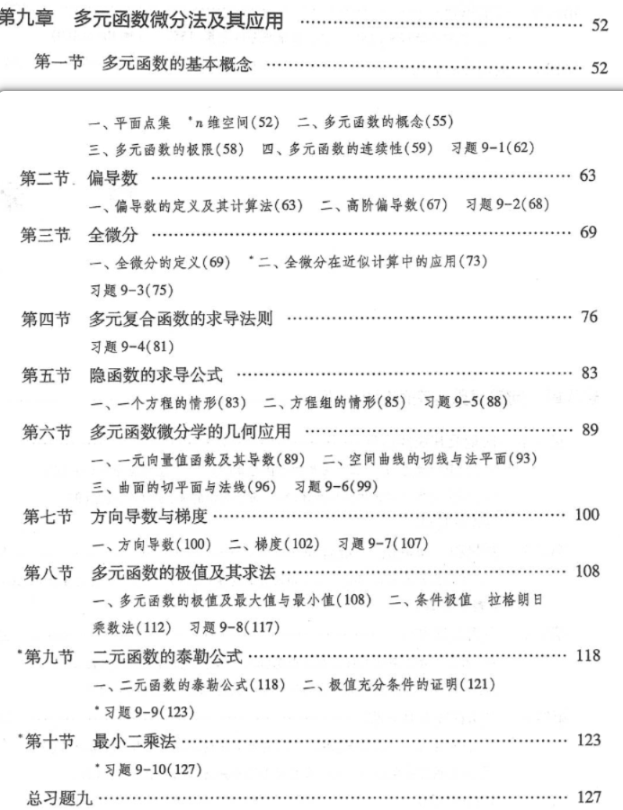</td>
<td>

- [ ] 9.1 多元函数的概念、极限与连续性
- [ ] 9.2 偏导数的定义、几何意义与高阶偏导数
- [ ] 9.3 全微分的定义、可微条件与全微分形式不变性
- [ ] 9.4 多元复合函数求导法则（链式法则）
- [ ] 9.5 隐函数求导公式（一个方程与方程组情形）
- [ ] 9.6 多元微分学的几何应用（空间曲线的切线与法平面、曲面的切平面与法线）
- [ ] 9.7 方向导数与梯度的概念及计算
- [ ] 9.8 多元函数的极值与最值、条件极值（拉格朗日乘数法）

</td>
</tr>
</table>

<b>第十章　重积分</b>

 

<table>
<tr>
<th width="50%">📖 教材原始目录</th>
<th width="50%">🤖 AI 生成大纲</th>
</tr>
<tr>
<td>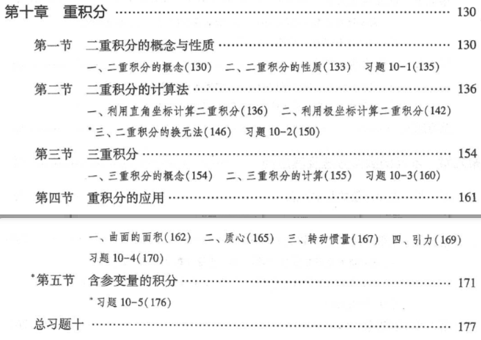</td>
<td>

- [ ] 10.1 二重积分的概念与性质
- [ ] 10.2 二重积分在直角坐标系下的计算
- [ ] 10.3 二重积分在极坐标系下的计算
- [ ] 10.4 三重积分的概念及其在直角坐标系下的计算
- [ ] 10.5 三重积分在柱面坐标与球面坐标系下的计算
- [ ] 10.6 重积分的应用（体积、曲面面积、质心与转动惯量）

</td>
</tr>
</table>

<b>第十一章　曲线积分与曲面积分</b>

 

<table>
<tr>
<th width="50%">📖 教材原始目录</th>
<th width="50%">🤖 AI 生成大纲</th>
</tr>
<tr>
<td>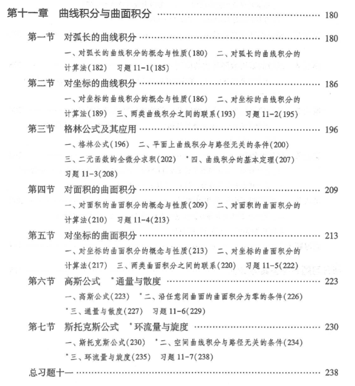</td>
<td>

- [ ] 11.1 对弧长的曲线积分（第一类曲线积分）
- [ ] 11.2 对坐标的曲线积分（第二类曲线积分）
- [ ] 11.3 格林公式及其应用（平面曲线积分与路径无关的条件）
- [ ] 11.4 对面积的曲面积分（第一类曲面积分）
- [ ] 11.5 对坐标的曲面积分（第二类曲面积分）
- [ ] 11.6 高斯公式与通量、散度
- [ ] 11.7 斯托克斯公式与环流量、旋度

</td>
</tr>
</table>

<b>第十二章　无穷级数</b>

 

<table>
<tr>
<th width="50%">📖 教材原始目录</th>
<th width="50%">🤖 AI 生成大纲</th>
</tr>
<tr>
<td>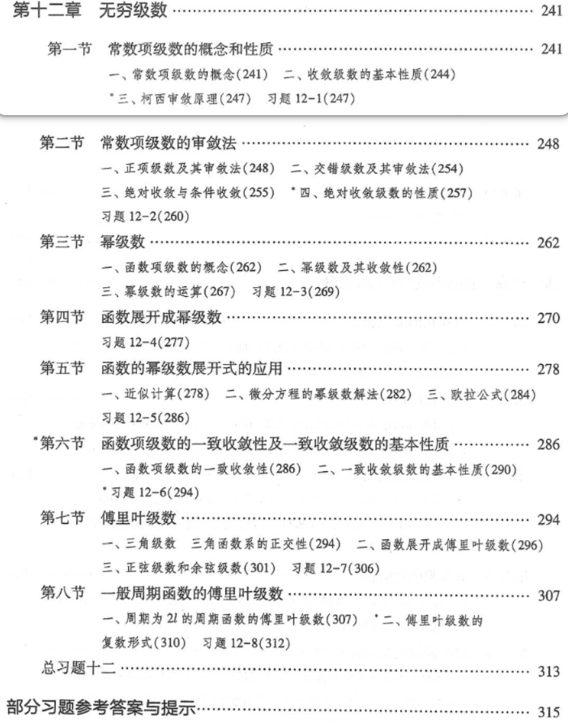</td>
<td>

- [ ] 12.1 常数项级数的概念与基本性质
- [ ] 12.2 正项级数及其审敛法（比较审敛法、比值审敛法、根值审敛法、积分审敛法）
- [ ] 12.3 任意项级数（交错级数莱布尼茨定理、绝对收敛与条件收敛）
- [ ] 12.4 幂级数及其收敛域（阿贝尔定理与收敛半径）
- [ ] 12.5 幂级数的性质与求和函数
- [ ] 12.6 函数展开成幂级数（泰勒级数与常见函数的麦克劳林展开）
- [ ] 12.7 傅里叶级数（三角函数系的正交性与周期为 2π、2L 的函数展开）

</td>
</tr>
</table>

---

